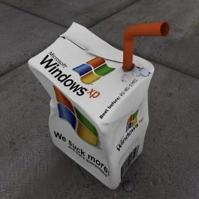

⠀⠀⠀⠀⠀⠀⠀⠀⠀⠀⠀⠀⠀⠀⠀⠀⠀⠀⠀⠀⠀⠀⠀⠀⠀⠀⠀⠀⠀⠀⠀⠀⠀⠀⠀⠀⠀⠀⠀⠀⠀⠀⠀⠀
⠀⠀⠀⠀⠀⠀⠀⠀⠀⠀⠀⣶⣄⠀⠀⢀⠀⠀⠀⠀⠀⠀⠀⠀⠀⠀⠀⠀⠀⠀
⠀⠀⠀⠀⠀⠀⠀⠀⠀⠀⢸⣿⣿⣷⣴⣿⡄⠀⠀⠀⠀⠀⢀⡀⠀⠀⠀⠀⠀⠀
⠀⠀⠀⠀⠀⠀⠀⠀⠰⣶⣾⣿⣿⣿⣿⣿⡇⠀⢠⣷⣤⣶⣿⡇⠀⠀⠀⠀⠀⠀
⠀⠀⠀⠀⠀⠀⠀⠀⠀⠙⣿⣿⣿⣿⣿⣿⣿⣀⣿⣿⣿⣿⣿⣧⣀⠀⠀⠀⠀⠀
⠀⠀⠀⠀⠀⠀⠀⣷⣦⣀⠘⣿⣿⣿⣿⣿⣿⣿⣿⣿⣿⣿⣿⣿⠃⠀⠀⠀⠀⠀
⠀⠀⠀⠀⢲⣿⣿⣿⣿⣿⣿⣿⣿⣿⣿⣿⣿⣿⣿⣿⣿⣿⡿⠁⠀⠀⠀⠀⠀⠀
⠀⠀⠀⠀⠀⠙⣿⣿⣿⣿⣿⣿⣿⣿⣿⣿⣿⣿⣿⣿⣿⡟⠁⠀⠀⠀⠀⠀⠀⠀
⠀⠀⠀⠀⠀⠚⠻⢿⣿⣿⣿⣿⣿⣿⣿⣿⣿⣿⣿⡿⠿⠿⠂⠀⠀⠀⠀⠀⠀⠀
⠀⠀⠀⠀⠀⠀⠀⠀⠀⠉⠙⢻⣿⣿⡿⠛⠉⡇⠀⠀⠀⠀⠀⠀⠀⠀⠀⠀⠀⠀
⠀⠀⠀⠀⠀⠀⠀⠀⠀⠀⠀⠘⠋⠁⠀⠀⠀⠸⡄⠀⠀⠀⠀⠀⠀⠀⠀⠀⠀⠀
⠀⠀⠀⠀⠀⠀⠀⠀⠀⠀⠀⠀⠀⠀⠀⠀⠀⠀⢳⡀⠀⠀⠀

 
# a damp maple leaf

습작 및 여러 생각들과 기억들을 남기는 공간입니다.

- - -

# PROFILE

      

            
            

 <!-- 구분선 -->
            <h1>XENA</h1>
            2002.08.30
            
-

            
에 (｡-_-｡)

      

      

          <!-- BGM 플레이어 -->
   

    

        

            
            ━━━━━━━━━
            
        

        

                <button id="btn-shuffle">⇆</button>
                <button id="btn-previous">◃</button>
                <button id="btn-play-pause">▶</button>
                <button id="btn-next">▹</button>
                <button id="btn-replay">↻</button>
        

    

